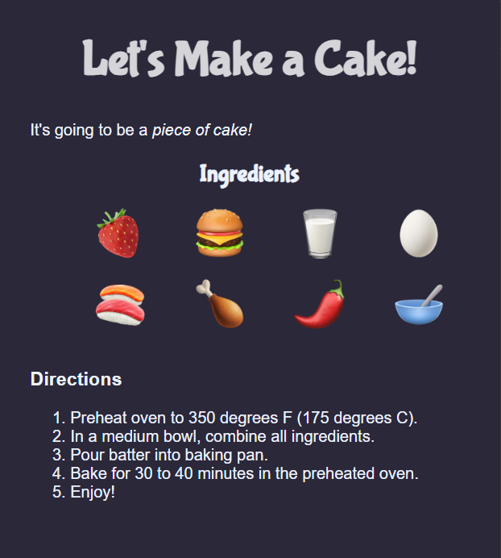

# 🎂 Let's Make a Cake

A fun beginner HTML & CSS project that displays a simple cake recipe with emojis, ingredients, and step-by-step directions.

## 📸 Preview

## 🚀 Features

- Semantic HTML structure
- Styled using CSS
- Emoji-based ingredients section
- Ordered recipe instructions
- Beginner-friendly layout

## 🛠️ Built With

- HTML5
- CSS3

## ▶️ Run Locally

Simply open `index.html` in your browser.

## 👨‍💻 Author

Talha Ahmer