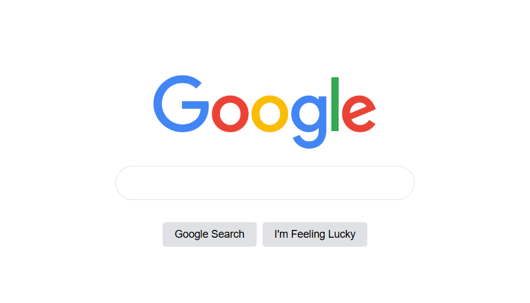

# 🔍 Google Homepage Clone

A simple clone of the Google homepage built using HTML and CSS. This project focuses on recreating the layout and styling of Google's search page.

## 📸 Preview

## 🚀 Features

- Google-style homepage
- Search bar design
- Styled buttons
- Responsive layout

## 🛠️ Built With

- HTML5
- CSS3

## ▶️ Run Locally

Open `index.html` in your browser.

## 👨‍💻 Author

Talha Ahmer