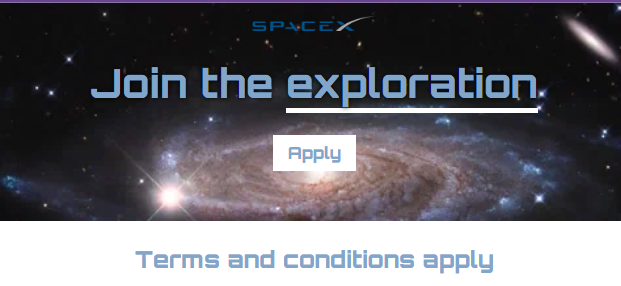

# 🚀 Space Exploration Landing Page

A modern landing page inspired by SpaceX, built using HTML and CSS. The project features a full-screen galaxy background, custom Google Fonts, and a clean call-to-action section.

## 📸 Preview

## 🚀 Features

- Space-themed hero section
- Full-width galaxy background image
- Custom Orbitron Google Font
- Call-to-action button
- Text shadow and underline effects
- Clean and minimal layout

## 🛠️ Built With

- HTML5
- CSS3
- Google Fonts (Orbitron)

## ▶️ Run Locally

1. Clone the repository.
2. Open `index.html` in your browser.

## 👨‍💻 Author

**Talha Ahmer**