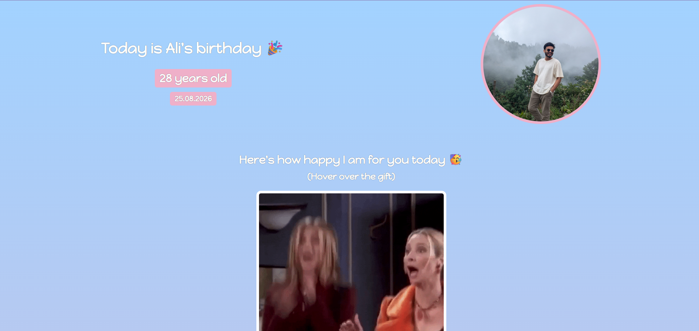

# 🎉 Interactive Birthday Gift Card

A fun and interactive birthday webpage built with HTML and CSS. The page celebrates a friend's birthday with personalized messages and surprise GIFs that are revealed when hovering over gift boxes.

## 📸 Preview

## ✨ Features

- Personalized birthday greeting
- Circular profile image
- Gradient background
- Hover-to-reveal animated GIFs
- Custom Google Font
- Responsive and clean layout

## 🛠️ Built With

- HTML5
- CSS3
- Google Fonts (Happy Monkey)

## ▶️ Run Locally

1. Clone the repository.
2. Open `index.html` in your preferred web browser.

## 👨‍💻 Author

**Talha Ahmer**