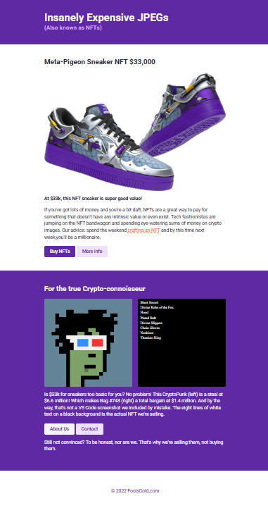

# 💎 NFT Landing Page

A responsive landing page built using **HTML** and **CSS** as part of my front-end development journey.

The project showcases a fictional NFT marketplace with modern styling, responsive layouts, and reusable button components.

---

## 📸 Preview

---

## 🚀 Features

- 📱 Fully Responsive Design
- 🎨 Modern Purple Theme
- 🖼️ Responsive Images
- 🔗 Reusable Button Components
- 📦 Flexbox Layout
- 📏 Fluid Container Width
- 📲 Mobile-Friendly Navigation Buttons
- ⚡ Clean and Semantic HTML
- 🎯 Accessibility-Friendly Image Alt Text

---

## 🛠️ Built With

- HTML5
- CSS3
- Flexbox
- Google Fonts (Roboto)

---

## 🚀 Getting Started

1. Clone the repository

2. Open the project folder.

3. Open `index.html` in your browser.

---

## 👨‍💻 Author

**Talha Ahmer**