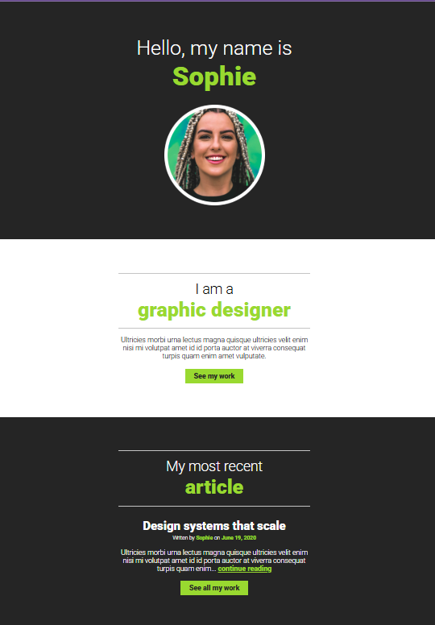

# 👩 Profile Website

A clean and responsive profile website built using **HTML** and **CSS**. This project showcases a simple portfolio-style landing page featuring an introduction, about section, and a featured article.

## 📸 Preview

---

## 🚀 Features

- Responsive layout
- Semantic HTML5 structure
- Modern typography using Google Fonts
- About Me section
- Featured article section
- Call-to-action buttons
- Mobile-friendly design
- Clean and minimal UI

---

## 🛠️ Built With

- HTML5
- CSS3
- Google Fonts (Roboto)

---

## 🚀 Getting Started

1. Clone the repository

2. Open the project folder.

3. Open `index.html` in your browser.

---

## 👨‍💻 Author

**Talha Ahmer**