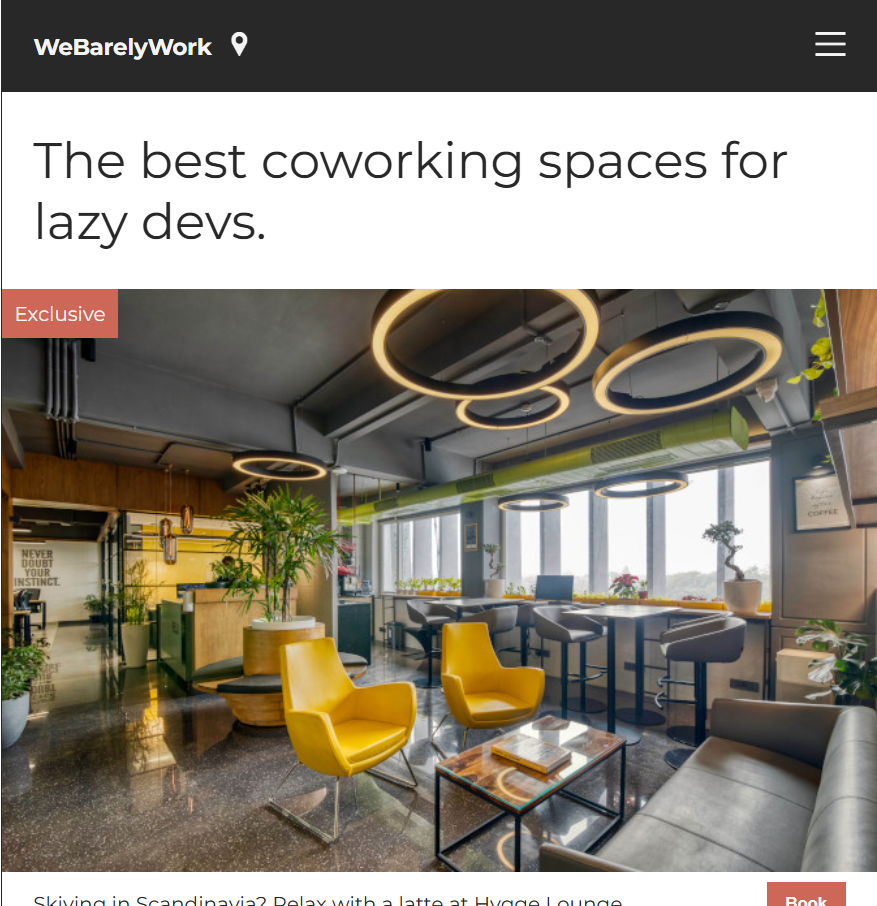

# 💼 WeBarelyWork – Coworking Spaces Landing Page

A modern and responsive landing page for a fictional coworking space brand, **WeBarelyWork**. This project was built using **HTML5** and **CSS3** to practice responsive layouts, Flexbox, positioning, and clean UI design.

## 📸 Preview

## 🚀 Features

- 🏢 Clean and modern landing page layout
- 📍 Navigation bar with logo and icons
- 🖼️ Featured coworking space cards
- 🏷️ "Exclusive" promotional badge
- 📱 Floating chat button
- 🎨 Responsive design for different screen sizes
- 📐 Built using CSS Flexbox and positioning

## 🛠️ Built With

- HTML5
- CSS3
- Google Fonts (Montserrat)

## ▶️ Getting Started

1. Clone the repository

2. Open the project folder.

3. Open `index.html` in your browser.

## 🙋‍♂️ Author

**Talha Ahmer**