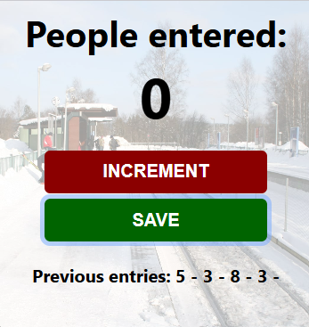

# 🚶 People Counter App

A simple JavaScript project that counts the number of people entering a location and allows saving previous entry counts. This project focuses on DOM manipulation, variables, functions, and event handling.

## 📸 Preview

## ✨ Features

- Increment people count
- Save previous entries
- Reset counter after saving
- Interactive buttons

## 🛠️ Built With

- HTML5
- CSS3
- JavaScript (ES6)

## ▶️ Run Locally

1. Clone the repository.
2. Open `index.html` in your preferred web browser.

## 👨‍💻 Author

**Talha Ahmer**