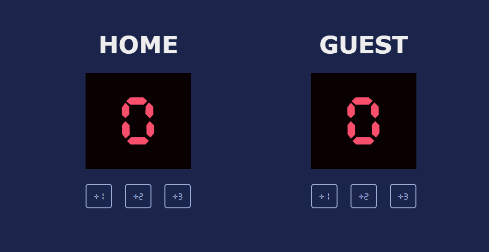

# 🏀 Basketball Scoreboard

A simple basketball scoreboard built with HTML, CSS, and JavaScript. The application allows users to keep track of scores for the Home and Guest teams by adding 1, 2, or 3 points with the click of a button.

## 📸 Preview

## ✨ Features

- Track scores for Home and Guest teams
- Add 1, 2, or 3 points with dedicated buttons
- Retro-style digital scoreboard design
- Custom scoreboard font

## 🛠️ Built With

- HTML5
- CSS3
- JavaScript (ES6)

## ▶️ Run Locally

1. Clone the repository.
2. Open `index.html` in your preferred web browser.

## 👨‍💻 Author

**Talha Ahmer**