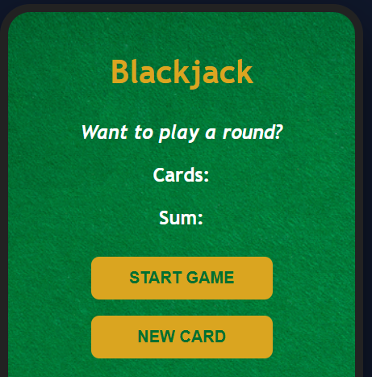

# 🃏 Blackjack Game

A simple Blackjack game built using **HTML**, **CSS**, and **JavaScript** as part of my JavaScript learning journey.

## 📸 Preview

## 🚀 Features

* 🎲 Random card generation
* 🃏 Blackjack card values

  * Ace = 11
  * Face Cards (J, Q, K) = 10
  * Number cards = Their face value
* ▶️ Start a new game
* ➕ Draw additional cards
* 💬 Dynamic game status messages

## 🛠️ Technologies Used

* HTML5
* CSS3
* JavaScript (ES6)

## 🎮 How to Play

1. Click **START GAME**.
2. Two random cards are dealt.
3. Your total score is displayed.
4. Click **NEW CARD** to draw another card.
5. The game ends when:

   * Your total equals **21** → Blackjack! 🎉
   * Your total exceeds **21** → You lose.
   * Your total is less than **21** → Continue drawing cards.

## 👨‍💻 Author

**Talha Ahmer**