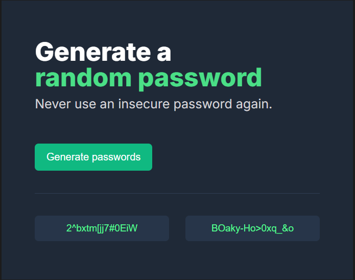

# 🔐 Password Generator

A simple password generator built with **HTML, CSS, and JavaScript**.

## 📸 Preview

## ✨ Features

- Generate **two random passwords**
- Each password is **15 characters long**
- Includes:
  - Uppercase letters
  - Lowercase letters
  - Numbers
  - Symbols

## 🛠️ Built With

- HTML5
- CSS3
- JavaScript (ES6)

## 🚀 How to Run

1. Clone the repository.
2. Open the project folder.
3. Open `index.html` in your browser.

## 👨‍💻 Author

**Talha Ahmer**