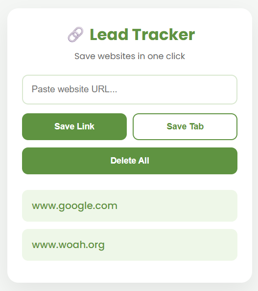

# 🔗 Lead Tracker

A simple Chrome extension built using **HTML**, **CSS**, and **JavaScript** that lets you save website URLs and your current browser tab for quick access later.

## 📸 Preview

## 🚀 Features

* 🔗 Save custom website URLs
* 📌 Save the currently active browser tab
* 💾 Store links using Local Storage
* 🌐 Open saved links in a new browser tab
* 🗑️ Delete all saved links
* 🎨 Clean and modern user interface
* ⚡ Built with Chrome Extension Manifest V3

## 🛠️ Technologies Used

* HTML5
* CSS3
* JavaScript (ES6)
* Chrome Extensions API
* Local Storage API

## 🎮 How to Use

1. Load the extension into Chrome using **Developer Mode**.
2. Click the **Lead Tracker** extension icon.
3. To save a custom URL:
   * Enter a website URL.
   * Click **Save Link**.
4. To save the current browser tab:
   * Open the webpage you want to save.
   * Click **Save Tab**.
5. Click any saved link to open it in a new browser tab.
6. Double-click **Delete All** to remove all saved links.

## 👨‍💻 Author

**Talha Ahmer**