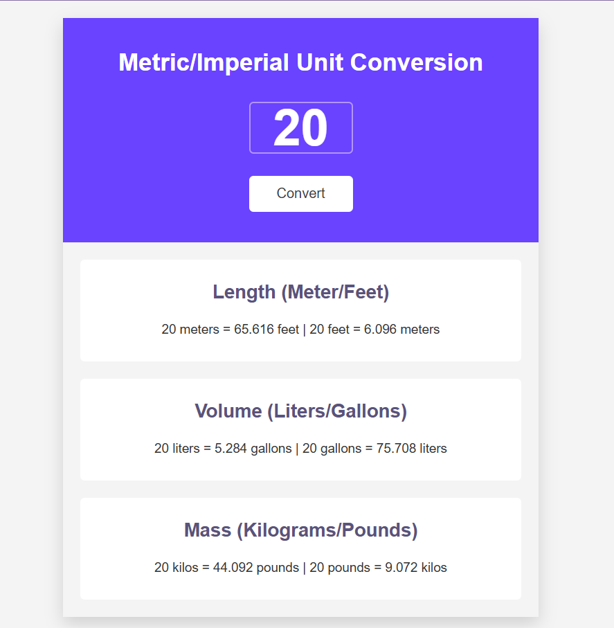

# 📏 Metric/Imperial Unit Converter

A simple Metric/Imperial Unit Converter built with **HTML**, **CSS**, and **JavaScript**.

## 📸 Preview

## 🚀 Features

- 📐 Convert **Meters ↔ Feet**
- 🧪 Convert **Liters ↔ Gallons**
- ⚖️ Convert **Kilograms ↔ Pounds**
- 🔄 Converts all three units with a single button click
- 🎯 Rounds results to two decimal places
- 📱 Clean, responsive, and modern UI

## 🛠️ Built With

- HTML5
- CSS3
- JavaScript (ES6)

## ▶️ How to Use

1. Enter a number into the input field.
2. Click the **Convert** button.
3. View the converted values for:
   - Length (Meters ↔ Feet)
   - Volume (Liters ↔ Gallons)
   - Mass (Kilograms ↔ Pounds)

## 👨‍💻 Author

**Talha Ahmer**