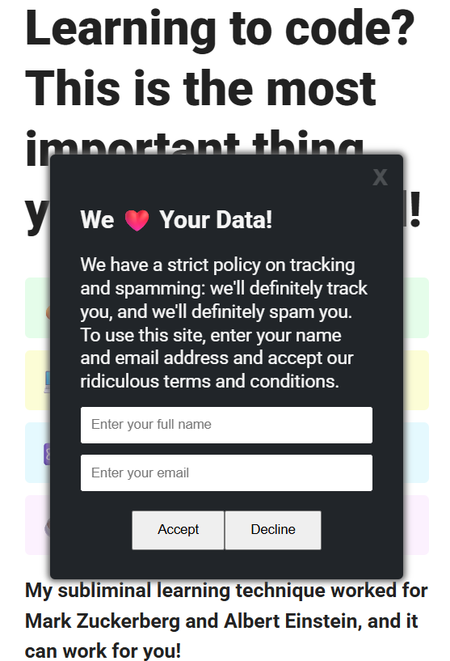

# 🍪 Cookie Consent Modal

A fun and interactive **Cookie Consent Modal** built with **HTML, CSS, and JavaScript**. This project simulates a humorous cookie consent popup that appears after a short delay, collects user information, displays a fake loading animation, and ends with a funny message.

---

## 📸 Preview

## ✨ Features

- ⏱️ Modal appears automatically after 1.5 seconds
- 📝 Form validation using HTML5
- 📧 Collects user's name and email
- 🔄 Loading animation after form submission
- 😄 Personalized success message using the user's name
- ❌ Close button disabled until the process finishes
- 🎭 "Decline" button playfully avoids being clicked
- 📱 Clean and responsive modal layout

---

## 🛠️ Built With

- HTML5
- CSS3
- JavaScript (ES6)

---

## 🚀 How to Run

1. Clone the repository.
2. Open the project folder.
3. Open `index.html` in your browser.

---

## 👨‍💻 Author

**Talha Ahmer**