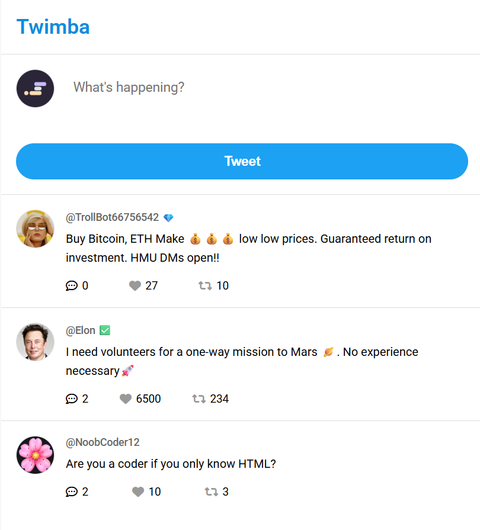

# 🐦 Twimba – Twitter Clone

A responsive Twitter/X-inspired feed built with **HTML, CSS, and JavaScript**. Users can create tweets, like posts, retweet them, and view replies through a clean and interactive interface.

## 📸 Preview

## ✨ Features

- Create and publish new tweets instantly
- Like and unlike tweets
- Retweet and undo retweets
- Toggle replies with a single click
- New tweets appear at the top of the feed
- Automatically generates a unique ID for every tweet using UUID
- Responsive layout for mobile, tablet, and desktop
- Clean Twitter-inspired user interface

## 🛠️ Built With

- HTML5
- CSS3
- JavaScript (ES6)
- Google Fonts (Roboto)
- Font Awesome Icons
- UUID Library

## 🚀 How to Run

1. Clone the repository.
2. Open the project folder.
3. Open `index.html` in your browser.

## 👨‍💻 Author

**Talha Ahmer**